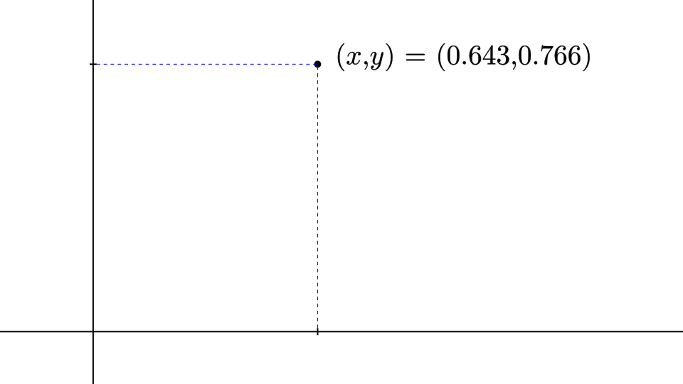
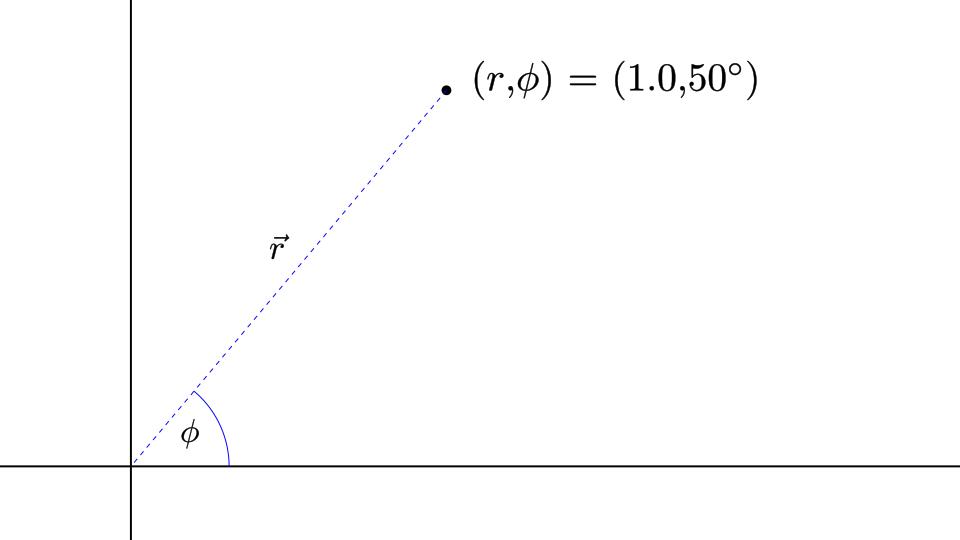

# Repo for second blog post

## How to use

Change the `Main.hs` file according to the animation you want to compile.

Then compile the animation, e.g. as gif:

```bash
stack ./src/Main.hs -- render -w 3840 -h 2160 --compile --format gif
```

## Animations

### Static star (incorrect)

```haskell
main :: IO ()
main = reanimate
  $ docEnv
  animationIncorrectStaticStar
```


### Static star

```haskell
main :: IO ()
main = reanimate
  $ docEnv
  animationStaticStar
```


### Static star (changed view)

```haskell
main :: IO ()
main = reanimate
  $ docEnv
  animationStaticStarView
```


### Static star (rotated by 90°)

```haskell
main :: IO ()
main = reanimate
  $ docEnv
  animationStaticStar90
```


### Demo Cartesian coordinates

```haskell
main :: IO ()
main = reanimate
  $ docEnv
  animationCartesianCoordinates
```




### Demo polar coordinates

```haskell
main :: IO ()
main = reanimate
  $ docEnv
  animationPolarCoordinates
```




### Static dot

```haskell
main :: IO ()
main = reanimate
  $ docEnv
  animationStaticDot
```


### Jumping dot

```haskell
main :: IO ()
main = reanimate
  $ docEnv
  animationJumpingDot
```


